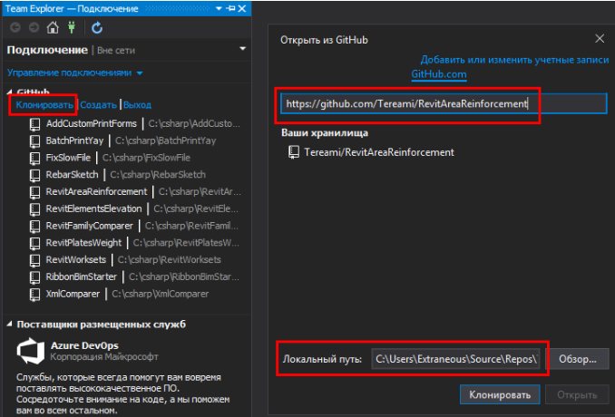
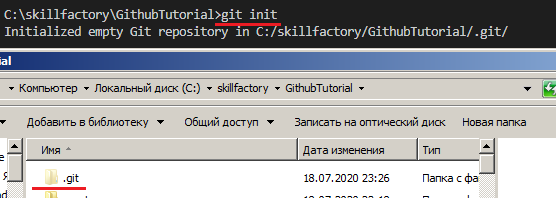
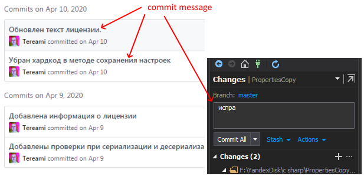
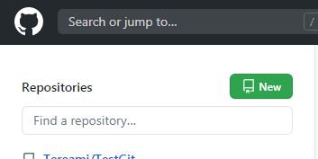

Всё начинается с *репозитория* - проще говоря, выделенного места, где будет хранится всё относящееся к проекту. В реальной работе вы, скорее всего, подключитесь  к уже готовому удаленному репозиторию и будете работать с ним. Но сейчас, для иллюстрации, кратко покажем все шаги полностью.

Если вы будете применять готовую среду разработки (*IDE*), в ней, скорее всего, будет удобный-красивый-готовый интерфейс для работы с Git, и многие команды из описанных ниже вы даже не увидите. Но проблема в том, что разных программах и интерфейс будет разный! Более универсальный способ - применять *командную строку*, хотя это может быть менее удобно. Но зато команды будут одинаковые не то что в разных *IDE*, но и даже в Windows и Linux.



*Подключение к удаленному репозиторию Github в Visual Studio*

Если же я работаю "с нуля", то для начала создаю репозиторий локально. Для этого в командной строке перехожу в папку, где будет лежать мой проект, и выполняю команду `git init` - получился *локальный репозиторий*.



Напомню, что Git - *распределённая* система контроля версий, так что мы имеем полноценный репозиторий и у себя на компьютере, и на удаленном сервере (хотя второго у нас пока еще нет!)

Если в папке уже были какие-то файлы, то можно их включить в репозиторий командой [git add](./command_add.md). Ну и всё, можно работать, изменять файлы, писать код. Если создаются новые файлы - добавляем через *git add*.

После того, как какой-то этап работы выполнен, надо его зафиксировать - сделать [commit](./command_commit). При этом также указывается короткий комментарий - что именно я сделал:



Но коммит еще не означает, что я отправил изменения на сервер! Если я еще не подключен к Github, то и там создать новый пустой репозиторий:



Указываем название репозитория, лицензию, Readme и gitignore создавать не надо, их можно добавить отдельно. Далее через командную строку подключаемся к Github, где указываем адрес репозитория:
```
git remote add origin https://github.com/user/projectname
```
И что бы отправить плоды своих трудов на сервер, используем команду [git push].

Что, если к моему проекту подключился еще один программист, или я сам с другого компьютера решил поработать? Тогда я могу клонировать репозиторий с Github на свой компьютер через [git clone]. И работать как обычно - commit, push (*git remote add* в таком случае сразу будет прописан).

Но что произойдет, если за время моей работы кто-то уже внёс свои изменения в репозиторий? Лучше было бы сначала получить к себе те изменения, что он внёс. Для того, чтобы быть в курсе изменений, надо периодически запускать команду [git pull].

В IDE ещё встречается команда *git sync* - при этом сразу будут выполнены *pull*, *commit* и *push*.

Кстати, *pull* - тоже "составная" команда, она состоит из *fetch* (узнать, что изменилось в удаленном репозитории) и *merge* (присоединить изменения к нашему репозиторию). Кстати, когда отправляем через *push* изменения на удаленный сервер - он тоже делает merge, но уже, так скажем, на "своей стороне".

---
[< К содержанию](./README.md) | [Далее >](./03_commit.md) 
