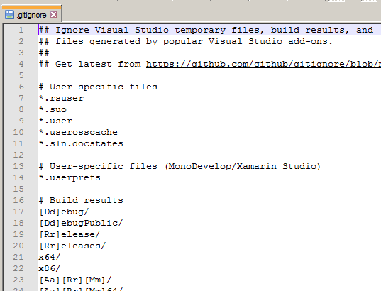

Часто бывает, что создаются файлы, необходимые только нам в данный момент, но которые не надо загружать в репозиторий, например:
* сведения об ошибках
* локальные настройки
* скомпилированные рабочие файлы, и т.д.

Но мы используем команду `git add .` и добавляем *все* файлы из папки. Конечно, можно вручную указывать, какие файлы добавлять, но проще задать правило, какие файлы нужно игнорировать.

Для этого в git предусмотрен специальный файл "*.gitignore*". Его нужно создать в корневой папке репозитория и указать шаблон имен файлов, которые нужно игнорировать, например:
* *thumbs.db* - все файлы thumbs.db
* **.avi* -все файлы с расширением .avi
* *_debug** - все файлы, имя которых начинается с _debug
* *users/* -папка users и все вложенные файлы
* *[Dd]ebug** - файлы, имя которых начинается с Debug или debug

Правила записываются в файле каждое в своей строке. С помощью символа # можно добавлять комментарии.

При использовании IDE файл gitignore, скорее всего, будет генерироваться автоматически, так как среда разработки уже знает, какие временные файлы она будет создавать. Например, так выглядит файл gitignore для проекта C# в Visual Studio:

[< К содержанию](./README.md) | [Далее >](./06_end.md) 
