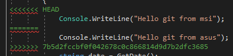
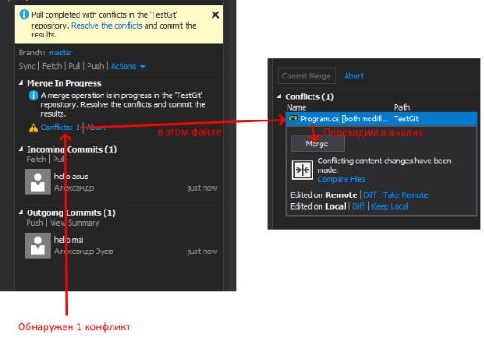
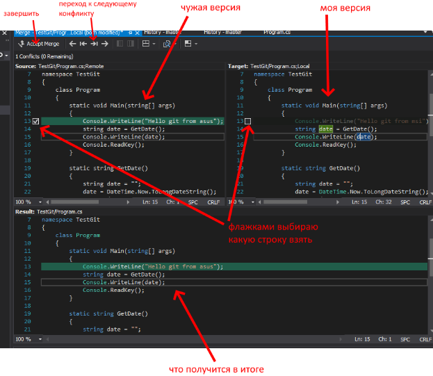

# Слияния и конфликты

Слияние, или *merge* - мне кажется, главная "магия" Git. При это он анализирует, что именно изменилось в тексте, и соединяет только части, в которые были внесены изменения.

Напрямую команда *merge* вызывается редко, но она часто входит в состав других команд. *Merge* выполняется в следующих случаях:
* когда я получаю в свой локальный репозиторий изменения, сделанные другими людьми в центральном репозитории (команда pull, в ней выполняется fetch и merge)
* когда записываю в центральный репозиторий то, что сделал локально (push, здесь merge уже в обратную сторону, можно сказать на стороне сервера)
* при слиянии ветвей.

Во всех этих случаях предполагается, что обе соединяемые версии вышли “из одной точки” - т.е. с определенной версии центрального репозитория; как с раз с состоянием проекта в этой точке и будут сравниваться изменения. Ну и конечно, важно чтобы логика кода сохранилась, не появились дублирующие друг друга участки кода и так далее.

Самый простой случай - когда какая-то часть кода в одной версии поменялась, а в другой - нет, тогда просто берем и заменяем старый блок кода на тот, который был изменен. Но что, если два человека отредактировали одну и ту же часть кода? 

Вообще Git достаточно умный и такие случаи может обработать. Например, если один человек изменил что-то в коде метода, а второй - переименовал метод и тоже его изменил, то в итоговой версии окажутся оба метода - работоспособность кода не сломается.

В других же случаях система сообщит, что автоматическое слияние сделать не удалось, и сообщит о конфликте. В коде появится вот такой блок:

В принципе, можно просто руками удалить ненужные строки и закоммитить решение конфликта, но при сложных конфликтах руками ковырять уже неудобно. В хороших IDE уже есть инструменты для более удобного разрешения конфликтов.
Например, сообщение в Visual Studio об обнаружении конфликта:

Интерфейс для работы с конфликтами:

После того, как конфликт разрешен, желательно сделать коммит и написать об этом в сообщении.

Но всё-таки программисты - люди тихие, неконфликтные! Лучше всего вообще не допускать конфликтов:
* заранее распределяйте задачи так, чтобы несколько людей не меняли один кусок кода;
* как можно чаще получайте актуальную версию через pull;
* если пользуетесь авто-форматированием кода - настройте его одинаково для всех;
* разделяйте большой проект на обособленные блоки.

[< К содержанию](./readme.md) | [Далее >](./06_branches.md) 
